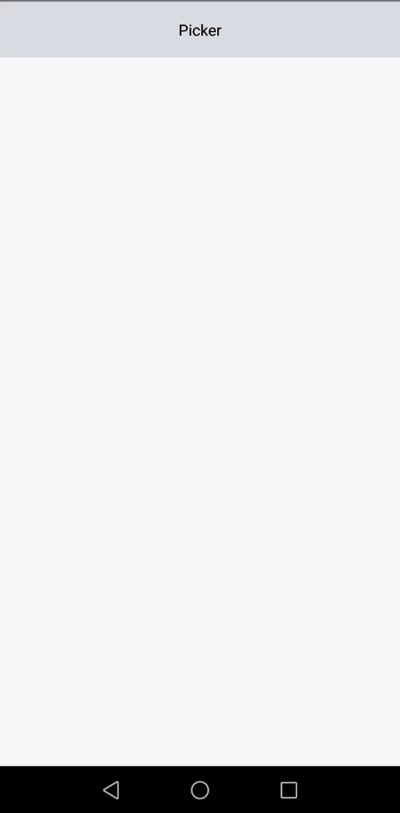

# react-native-multi-select-picker


> react-native-select-multiple is a customiseable  flatlist picker that allows you to select multiple items.


## Install

```sh
npm install react-native-multi-select-picker
```

## Usage

```js
import * as React from 'react'
import { StyleSheet, Text, View, TouchableOpacity, Image, ScrollView } from 'react-native'
import { MultipleSelectPicker } from 'react-native-multi-select-picker'

export default class App extends React.Component<any, {}> {
    state = {
        selectectedItems: [],
        isShownPicker: false
    }
    multiSelect

    render() {
        const items = [
            { label: 'itachi', value: '1' },
            { label: 'kakashi', value: '2' },
            { label: 'madara', value: '3' },
            { label: 'menato', value: '4' },
            { label: 'naruto', value: '5' },
            { label: 'hinata', value: '6' },
            { label: 'jiraya', value: '7' },
            { label: 'tsunade', value: '8' },
            { label: 'naruto', value: '9' },
            { label: 'sasuke', value: '10' },
            { label: 'hashirama', value: '11' },
            { label: 'tobirama', value: '12' },
            { label: 'pain', value: '13' },
            { label: 'sarada', value: '14' },
            { label: 'sakura', value: '15' },
            { label: 'asura', value: '16' },
            { label: 'indra', value: '17' }
        ]
        return (
            <ScrollView>
                <TouchableOpacity
                    onPress={() => {
                        this.setState({ isShownPicker: !this.state.isShownPicker })
                    }}
                    style={{ height: 50, width: '100%', justifyContent: 'center', alignItems: 'center', backgroundColor: '#dadde3' }}
                >
                    <Text>Picker</Text>
                </TouchableOpacity>
                {this.state.isShownPicker ? <MultipleSelectPicker
                    items={items}
                    onSelectionsChange={(ele) => { this.setState({ selectectedItems: ele }) }}
                    selectedItems={this.state.selectectedItems}
                    buttonStyle={{ height: 100, justifyContent: 'center', alignItems: 'center' }}
                    buttonText='hello'
                    checkboxStyle={{ height: 20, width: 20 }}
                />
                    : null
                }

                {(this.state.selectectedItems || []).map((item: any, index) => {
                    return <Text key={index}>
                        {item.label}
                    </Text>
                })}

            </ScrollView >
        )
    }
}


```


## Properties

| Prop  | Default  | Type | Description |
| :------------ |:---------------:| :---------------:| :-----|
| items | - | `array` | All items available in the list (array of `string` or `{ label, value }`) |
| selectedItems | `[]` | `array` | The currently selected items (array of `string` or `{ label, value }`) |
| onSelectionsChange | - | `func` | Callback called when a user selects or de-selects an item, passed `(selections, item)` |
| keyExtractor | `index` | `func` | [keyExtractor](https://facebook.github.io/react-native/docs/flatlist.html#keyextractor) prop for the `FlatList` |
| checkboxSource | [image](images/icon-checkbox.png) | `object` | [Image source](https://facebook.github.io/react-native/docs/image.html#source) for the checkbox (unchecked). |
| selectedCheckboxSource | [image](images/icon-checkbox-checked.png) | `object` | [Image source](https://facebook.github.io/react-native/docs/image.html#source) for the checkbox (checked). |
| flatListProps | {} | `object` | Additional props for the flat list |
| style | [default styles](src/SelectMultiple.styles.js) | `object` | [Style](https://facebook.github.io/react-native/docs/scrollview.html#style) for the `FlatList` container. |
| rowStyle | [default styles](src/SelectMultiple.styles.js) | `object` | [Style](https://facebook.github.io/react-native/docs/view.html#style) for the row container. |
| checkboxStyle | [default styles](src/SelectMultiple.styles.js) | `object` | [Style](https://facebook.github.io/react-native/docs/image.html#style) for the checkbox image. |
| labelStyle | [default styles](src/SelectMultiple.styles.js) | `object` | [Style](https://facebook.github.io/react-native/docs/text.html#style) for the text label. |
| selectedRowStyle | [default styles](src/SelectMultiple.styles.js) | `object` | [Style](https://facebook.github.io/react-native/docs/view.html#style) for the row container when selected. |
| selectedCheckboxStyle | [default styles](src/SelectMultiple.styles.js) | `object` | [Style](https://facebook.github.io/react-native/docs/image.html#style) for the checkbox image when selected. |
| selectedLabelStyle | [default styles](src/SelectMultiple.styles.js) | `object` | [Style](https://facebook.github.io/react-native/docs/text.html#style) for the text label when selected. |
| renderLabel | null | `func` | Function for render label. |

## Contribute

Fell free to modify or open issues or to give pull requests..

## License

[ISC](LICENSE) 

----